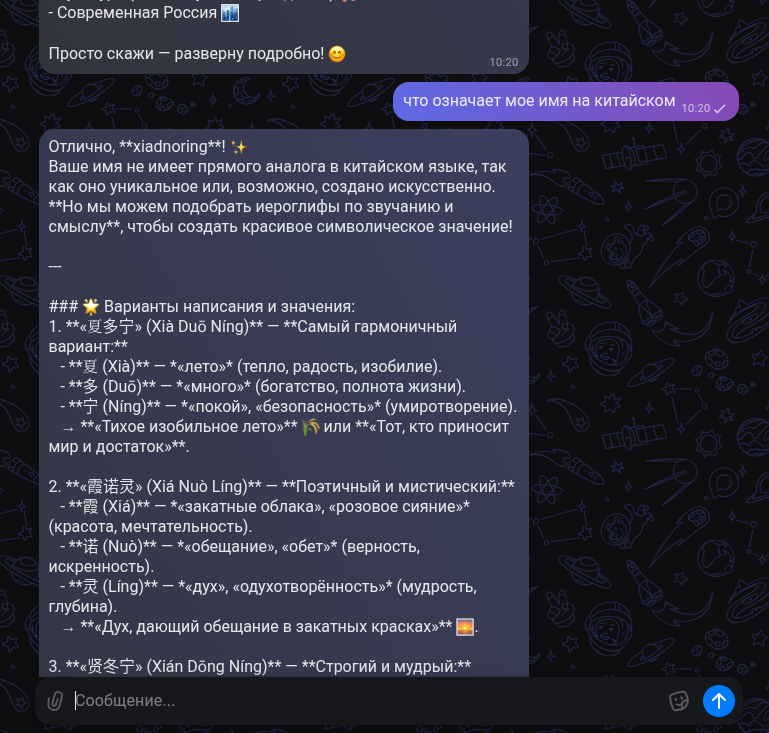

# MaxBot Header-Only

## Introduction
This is a header-only (one file) library
for creating bots in the Max Messanger on C++.

## Dependency
- Manapi Http (with Fetch)

## Example



```c++
#include <iostream>

#include <MaxBot.hpp>

static manapi::Atomic<std::string> openrouter_key = "";

int main() {
    auto ctx = manapi::async::context::create(0);
    ctx->eventloop()->setup_handle_interrupt();

    ctx->logger()->callback(
        [mx = std::make_shared<manapi::async::tmutex>()](manapi::logger_type type, std::string_view service, int error_code, std::string msg)
        -> void {
        manapi::async::run(manapi::async::invoke(+[](std::shared_ptr<manapi::async::tmutex> mx, manapi::logger_type type, std::string_view service, int error_code, std::string msg) -> manapi::future<> {
            auto lk = co_await mx->lock_guard();
            (type == manapi::logger_type::LOGGER_ERROR ? std::cerr : std::cout)
                << "[" << service.substr(1) << "][" << error_code << "]: " << msg << "\n";
        }, mx, type, service, error_code, std::move(msg)));
    });

    ctx->run(ctx, 0, [] (auto cb) -> void {
        auto maxbot = manapi::maxbot("maxbotkey");

        manapi::async::run ([maxbot] () mutable noexcept(true)
            -> manapi::future<> {

            openrouter_key = manapi::json::parse(co_await manapi::filesystem::async_read("../trash/config.json"))
                ["openrouter"].as_string();

            maxbot.on("message_created", [](manapi::maxbot &self, manapi::json &data)
                    -> manapi::future<bool> {
                auto const user_id = data["message"]["sender"]["user_id"].as_integer();
                auto const chat_id = data["message"]["recipient"]["chat_id"].as_integer();

                auto const &text = data["message"]["body"]["text"];
                if (!text.is_string()
                    || !text.as_string().starts_with('/'))
                    co_return false;

                /* is a command */

                std::string_view const cmd{text.as_string().data() + 1, text.as_string().size() - 1};

                if (cmd == "start") {
                    manapi::json response = co_await self.send_message(user_id, chat_id, {
                        {"text", std::format("Hello, {}. You are here.\nWhat do you want to ask me?",
                            data["message"]["sender"]["first_name"].as_string())}
                    });
                }
                else {
                    manapi::json response = co_await self.send_message(user_id, chat_id, {
                            {"text", std::format("Invalid command: {}", cmd)},
                    });
                }

                co_return true;
            });

            maxbot.on("message_created", [](manapi::maxbot &self, manapi::json &data)
                -> manapi::future<bool> {
                auto const user_id = data["message"]["sender"]["user_id"].as_integer();
                auto const chat_id = data["message"]["recipient"]["chat_id"].as_integer();
                auto const &firstname = data["message"]["sender"]["first_name"].as_string();


                ssize_t const from = std::chrono::duration_cast<std::chrono::seconds>(
                    std::chrono::system_clock::now().time_since_epoch()).count();

                manapi::json history = co_await self.get_messages(manapi::json {
                    {"chat_id", chat_id},
                    {"count", 15}
                });

                manapi::json memory = manapi::json::array();

                for (auto &history_block : history["messages"].each()) {
                    if (history_block["sender"]["is_bot"].as_bool()) {
                        /* assistant */
                        memory.push_back(manapi::json::object({
                            {"role", "assistant"}
                        }));
                    }
                    else {
                        memory.push_back(manapi::json::object({
                            {"role", "user"}
                        }));
                    }

                    if (history_block["body"]["text"].is_string())
                        (*memory.as_array().rbegin())["content"] = history_block["body"]["text"].as_string_cast();
                    else
                        (*memory.as_array().rbegin())["content"] = std::string{};
                }

                memory.push_back({
                    {"role", "user"},
                    {"content", std::move(data["message"]["body"]["text"])}
                });

                std::string err{};

                try {
                    auto key = openrouter_key.get();
                    auto response = co_await manapi::net::fetch2::fetch("https://openrouter.ai/api/v1/chat/completions", {
                        {"headers", {
                            {"content-type", "application/json"},
                            {"authorization", std::format("Bearer {}", *key)}
                        }},
                        {"method", "POST"}
                    }, manapi::json({
                        {"model", "deepseek/deepseek-r1-0528:free"},
                        {"messages", std::move(memory)}
                    }).dump());

                    auto msg = co_await response.json();
                    std::string const text = std::move(std::move(msg["choices"][0]["message"]["content"].as_string()));
                    for (size_t pos = 0; pos < text.size(); pos+=4000) {
                        co_await self.send_message(user_id, chat_id, {
                               {"text", text.substr(pos, 4000)},
                        });
                    }
                }
                catch (std::exception const &e) {
                    err = e.what();
                }

                if (!err.empty()) {
                    manapi::json response = co_await self.send_message(user_id, chat_id, {
                            {"text", std::format("error was occurred due to {}", err)},
                    });
                }

                co_return true;
            });

            maxbot.bind(500);

        });

        cb();
    });
    return 0;
}
```